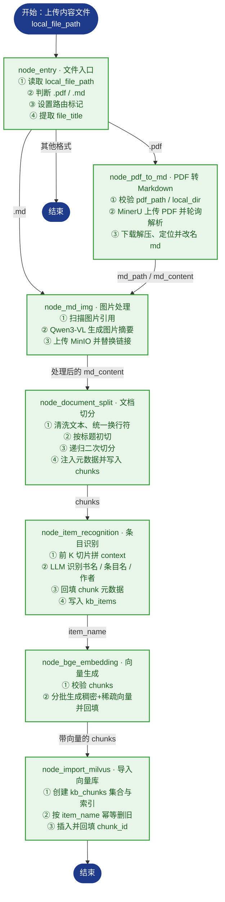
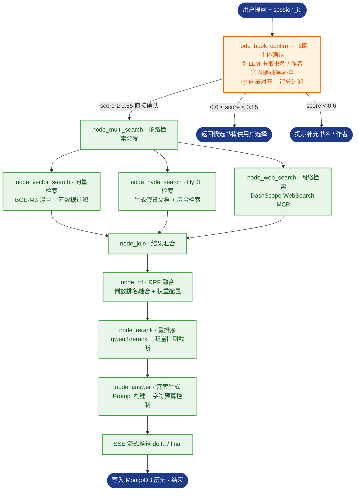

# ListenBook_Rag · 听书智库

> 面向听书平台的 RAG（Retrieval-Augmented Generation）智能知识库系统。围绕 **有声书信息 / 书籍简介 / 作者介绍 / 听书笔记 / 推荐运营资料 / 用户评论摘要 / 常见问答** 七类内容，提供 **书籍推荐、书籍详情、内容检索、知识问答** 四大能力，支持多轮对话与流式输出。工作流由 LangGraph 编排，以 BGE-M3 混合向量 + Milvus 承载检索，FastAPI 对外提供接口。

[](https://github.com/python/cpython)
[](https://github.com/fastapi/fastapi)
[](https://github.com/langchain-ai/langgraph)
[](https://github.com/milvus-io/milvus)
[](https://huggingface.co/collections/BAAI/bge)
[](https://www.mongodb.com/)
[](https://github.com/minio/minio)

## 目录

- [项目简介](#项目简介)
- [核心能力（业务场景）](#核心能力业务场景)
- [核心特性](#核心特性)
- [技术栈](#技术栈)
- [目录结构](#目录结构)
- [知识库内容模型](#知识库内容模型)
- [导入管线（Content Pipeline）](#导入管线content-pipeline)
- [检索与问答管线（Query Pipeline）](#检索与问答管线query-pipeline)
- [快速开始](#快速开始quick-start)
- [环境变量配置](#环境变量配置)
- [HTTP 接口](#http-接口)
- [测试](#测试)
- [已知限制与路线图](#已知限制与路线图)
- [附录：节点分步说明](#附录节点分步说明)

## 项目简介

听书场景下的知识高度分散：书籍简介、作者背景、演播信息、听书笔记、运营推荐语、用户评论、常见问答等资料分散在不同文档中，用户想“找一本适合通勤听的悬疑小说”“《三体》有哪些精彩书评”时，只能靠人工翻找或关键词搜索，语义理解弱、结果不可解释、来源难追溯。

listenbook_rag 用 RAG 的思路解决这个问题——**先检索、再生成**：

- **Retrieval（检索）**：把用户问题转换为向量，在知识库中检索相似内容；
- **Augmented（增强）**：将检索到的书籍资料作为上下文，与问题一起构建 Prompt；
- **Generation（生成）**：由 LLM 基于增强后的 Prompt 生成答案，并回传来源（书名 / 作者 / 内容类型 / 文件名）。

系统分为两条主线：**内容导入管线**把多类型听书资料加工为可检索切片并写入 Milvus；**检索问答管线**通过多路召回 + 融合排序，输出准确、可解释、可追溯的答案。

## 核心能力（业务场景）

| 能力         | 说明                                                         | 典型提问                                             |
| ------------ | ------------------------------------------------------------ | ---------------------------------------------------- |
| **书籍推荐** | 按书名 / 作者 / 类别 / 场景标签查找，返回书籍列表、特色、适合人群与推荐理由 | “有哪些科幻类有声书？”“推荐一个适合通勤听的悬疑小说” |
| **书籍详情** | 查询书籍简介、作者介绍、有声书时长、演播信息、内容标签、听书亮点与常见问题 | “《三体》的演播是谁？多长时间？”                     |
| **内容检索** | 定位书籍资料与听书笔记，返回书名、作者、内容类型、文件名等来源信息 | “《红楼梦》相关的听书笔记有哪些？”                   |
| **知识问答** | 基于知识库内容生成答案，附带引用来源，支持多轮对话与流式输出 | “这本书适合谁听？核心看点是什么？”                   |

> 交互上支持 **单轮问答 / 多轮对话 / SSE 流式输出 / 历史记录管理**。

## 核心特性

- **LangGraph 有状态编排**：`StateGraph` + 条件路由，PDF / Markdown 双入口自动分流，导入与查询两条链路复用同一套状态管理
- **多类型内容统一建模**：七类内容（有声书信息 / 书籍简介 / 作者介绍 / 听书笔记 / 推荐运营资料 / 用户评论摘要 / 常见问答）统一字段模型，导入即带上元数据
- **PDF 结构化解析**：接入 MinerU 在线 API（上传 → 轮询 → 下载解压 → 统一命名），保留表格 / 公式 / 图片
- **图片语义化**：Qwen3-VL-Flash 视觉模型生成图片描述，图片上传 MinIO，Markdown 引用替换为 ``
- **标题感知切分**：按 Markdown 标题层级初切 → `RecursiveCharacterTextSplitter` 递归二次切分 → 注入 `title` / `parent_title` / `file_title` / `part` 元数据
- **条目主体识别**：LLM 从文档前 K 个切片识别书名 / 作者 / 条目名（`item_name`），回填每个 chunk，支撑后续按书籍过滤
- **稠密 + 稀疏混合向量**：BGE-M3 生成 1024 维稠密向量（语义）与稀疏向量（词袋，精确关键词匹配）
- **多路召回 + 融合排序**：向量检索 / HyDE 假设文档检索 / MCP 网络搜索三路并行，RRF 融合后用 qwen3-rerank 精排，断崖检测动态截断
- **流式问答与记忆**：FastAPI + SSE 实时推送进度与答案，MongoDB 管理多轮历史对话（含 item_names 延迟回填）
- **工程化基础**：uv 锁定依赖、loguru 日志、任务进度追踪、令牌桶限流、提示词模板化管理

## 技术栈

| 类别        | 选型                                                         |
| ----------- | ------------------------------------------------------------ |
| 语言 / 环境 | Python ≥ 3.11，uv 包管理（`uv.lock` 已提交）                 |
| 后端框架    | FastAPI + Uvicorn（异步、原生 SSE 流式响应）                 |
| 工作流      | LangGraph + LangChain（状态管理 + 条件路由 + 并发编排）      |
| LLM         | 通义千问 Qwen-Flash（阿里云百炼 DashScope，OpenAI 兼容模式） |
| 视觉模型    | 通义千问 Qwen3-VL-Flash（图片描述生成）                      |
| 向量模型    | BGE-M3（1024 维稠密 + 稀疏混合向量）                         |
| 重排序模型  | qwen3-rerank（Cross-Encoder 精排 + 断崖检测截断）            |
| 向量数据库  | Milvus（混合检索）                                           |
| 文档数据库  | MongoDB（历史对话记录管理）                                  |
| 对象存储    | MinIO（原始文档 + 图片）                                     |
| 文档解析    | MinerU（PDF → Markdown，保留表格 / 公式 / 图片）             |
| 前端        | 原生 HTML + JavaScript + EventSource（SSE 流式接收）         |
| 日志        | loguru                                                       |

## 目录结构

```text
listenbook_rag/
├── README.md
├── .gitignore
└── knowledge_base/                # 项目主体（在此目录执行 uv 命令）
    ├── pyproject.toml             # 依赖与项目元信息
    ├── uv.lock                    # 锁定版本（提交，可复现环境）
    ├── .env.example               # 环境变量模板（提交）
    ├── app/
    │   ├── import_process/        # ★ 内容导入模块
    │   │   ├── agent/
    │   │   │   ├── state.py       # LangGraph 状态定义
    │   │   │   ├── main_graph.py  # 导入图编排（条件路由 + 7 节点）
    │   │   │   └── nodes/         # 7 个导入节点实现
    │   ├── query_process/         # ★ 检索问答模块
    │   │   ├── agent/
    │   │   │   ├── state.py       # 查询状态定义
    │   │   │   ├── query_graph.py # 查询图编排（多路召回 + 融合）
    │   │   │   └── nodes/         # 检索 / 融合 / 重排 / 生成节点
    │   ├── api/                   # FastAPI 路由（upload / status / query / stream / history）
    │   ├── clients/               # Milvus / MinIO / Mongo 客户端封装
    │   ├── conf/                  # 各服务配置类（读取 .env）
    │   ├── core/                  # logger、load_prompt
    │   ├── lm/                    # LLM / BGE-M3 / reranker 封装
    │   ├── tool/                  # 模型下载脚本
    │   └── utils/                 # 路径、限流、任务进度、SSE 队列等工具
    ├── prompts/                   # .prompt 提示词模板
    ├── web/                       # 前端页面（上传页 / 问答页）
    ├── test/                      # 环境验证与链路测试
    ├── doc/                       # 输入文档池（Git 忽略，clone 后自建）
    ├── output/                    # 处理产物（Git 忽略，clone 后自建）
    └── logs/                      # 运行日志（Git 忽略）
```

## 知识库内容模型

每条内容统一为如下字段，保证检索结果可解释、可追溯：

| 字段           | 说明                                        |
| -------------- | ------------------------------------------- |
| `content`      | 内容正文                                    |
| `content_type` | 内容类型（见下表）                          |
| `book_name`    | 书名                                        |
| `author`       | 作者名                                      |
| `item_name`    | 条目名称（识别出的主体，用于过滤）          |
| `category`     | 类别 / 标签（小说 / 非小说 / 儿童 / 教育…） |
| `duration`     | 有声书时长（仅有声书类内容）                |
| `source_file`  | 来源文件名                                  |
| `source_path`  | 来源路径或资源链接                          |

**内容类型枚举**

| 枚举值            | 说明         |
| ----------------- | ------------ |
| `audiobook_info`  | 有声书信息   |
| `book_intro`      | 书籍简介     |
| `author_intro`    | 作者介绍     |
| `listening_note`  | 听书笔记     |
| `recommendation`  | 推荐运营资料 |
| `comment_summary` | 用户评论摘要 |
| `faq`             | 常见问答     |

## 导入管线（Content Pipeline）



| #    | 节点                  | 职责            | 关键产物 / 动作                                              |
| ---- | --------------------- | --------------- | ------------------------------------------------------------ |
| 1    | node_entry            | 文件入口        | 判断 `.pdf` / `.md`，设置路由标记，提取 `file_title`         |
| 2    | node_pdf_to_md        | PDF 转 Markdown | MinerU 上传解析、轮询、解压取 md                             |
| 3    | node_md_img           | 图片处理        | Qwen3-VL 摘要 + 上传 MinIO + 替换 Markdown 链接              |
| 4    | node_document_split   | 文档切分        | 标题初切 + 递归二次切分 + 元数据注入 → `chunks`（备份 JSON） |
| 5    | node_item_recognition | 条目识别        | LLM 识别书名 / 条目名 / 作者，回填 chunk，写入 `kb_items`    |
| 6    | node_bge_embedding    | 向量生成        | BGE-M3 批量生成稠密 + 稀疏向量                               |
| 7    | node_import_milvus    | 导入向量库      | 建 `kb_chunks`、按 `item_name` 幂等删旧、插入并回填 `chunk_id` |

## 检索与问答管线（Query Pipeline）



| #    | 节点               | 职责         | 关键动作                                                     |
| ---- | ------------------ | ------------ | ------------------------------------------------------------ |
| 1    | node_book_confirm  | 书籍主体确认 | LLM 提取书名 / 作者 → 向量对齐 → 评分分级（确认 / 候选 / 追问） |
| 2    | node_multi_search  | 多路检索分发 | 并发触发三路检索节点                                         |
| 3    | node_vector_search | 向量检索     | BGE-M3 混合向量检索 + 按书名 / 类型过滤                      |
| 4    | node_hyde_search   | HyDE 检索    | 生成假设文档 → 组合向量检索，提升模糊问题召回                |
| 5    | node_web_search    | 网络检索     | MCP 协议调用 DashScope WebSearch，补充时效信息               |
| 6    | node_join          | 结果汇合     | 等待三路完成，统一格式                                       |
| 7    | node_rrf           | RRF 融合     | 倒数排名融合，去重排序                                       |
| 8    | node_rerank        | 重排序       | qwen3-rerank 精排 + 断崖检测动态截断                         |
| 9    | node_answer        | 答案生成     | Prompt 组装（含历史 + 资料）→ LLM 生成 → SSE 流式输出        |

## 快速开始（Quick Start）

> 环境要求：Python ≥ 3.11、uv、可访问的 Milvus / MongoDB / MinIO 服务。

### 1. 安装 uv（已安装可跳过）

```powershell
# Windows（PowerShell）
powershell -ExecutionPolicy ByPass -c "irm https://astral.sh/uv/install.ps1 | iex"
```

```bash
# macOS / Linux
curl -LsSf https://astral.sh/uv/install.sh | sh
```

### 2. 还原依赖环境

```bash
cd knowledge_base
uv sync --frozen
```

### 3. 配置环境变量

```bash
# Windows
Copy-Item .env.example .env
# macOS / Linux
cp .env.example .env
```

打开 `.env` 按注释填写，至少确认：

- 百炼 LLM：`OPENAI_API_KEY`、`OPENAI_BASE_URL`、`LLM_DEFAULT_MODEL`、`VL_MODEL`
- MinerU：`MINERU_API_TOKEN`（PDF 入口必需）
- Milvus：`MILVUS_URL`（默认 `http://localhost:19530`）
- MinIO：`MINIO_ENDPOINT` 填 `IP:9000`（不带 `http://`，且不是 9001 控制台端口）
- MongoDB：`MONGO_URI`、`MONGO_DB_NAME`
- BGE-M3：`BGE_M3_PATH` 指向本地模型；留空则首次运行自动下载

### 4. 准备输入文档

`doc/`、`output/` 已被 Git 忽略，clone 后需手动创建：

```powershell
New-Item -ItemType Directory doc, output
```

将听书资料（书籍简介 / 作者介绍 / 听书笔记 / 推荐语 / 评论摘要 / FAQ 等）放入 `doc/`。

### 5. 启动服务

```bash
uv run uvicorn app.api.main:app --reload --port 8000
```

打开 `http://localhost:8000/` 进入前端页面（上传 + 问答）。

### 6. 代码方式调用导入管线

```python
from app.import_process.agent.main_graph import kb_import_app
from app.import_process.agent.state import create_default_state

state = create_default_state(
    task_id="demo_001",
    local_file_path="doc/三体_书籍简介.md",   # 相对 knowledge_base 目录
    local_dir="output",
)
result = kb_import_app.invoke(state)

print("识别主体：", result["item_name"])
print("切片数量：", len(result["chunks"]))
```

## 环境变量配置

各配置项均以 `knowledge_base/.env.example` 为准，此处为概要：

| 配置区块    | 是否必需        | 关键变量                                                     | 说明                   |
| ----------- | --------------- | ------------------------------------------------------------ | ---------------------- |
| LLM（百炼） | 必需            | `OPENAI_API_KEY` `OPENAI_BASE_URL` `LLM_DEFAULT_MODEL` `VL_MODEL` | 文本 / 视觉模型        |
| MinerU      | PDF 入口必需    | `MINERU_API_TOKEN` `MINERU_BASE_URL`                         | PDF 转 Markdown        |
| Milvus      | 必需            | `MILVUS_URL` `CHUNKS_COLLECTION` `ITEM_NAME_COLLECTION` `EMBEDDING_DIM` | 向量库与集合名         |
| MongoDB     | 必需            | `MONGO_URI` `MONGO_DB_NAME` `SESSION_COLLECTION`             | 历史对话记录           |
| BGE-M3      | 必需            | `BGE_M3_PATH` `BGE_DEVICE` `BGE_FP16`                        | 本地模型路径或在线兜底 |
| MinIO       | md 含图片时必需 | `MINIO_ENDPOINT` `MINIO_ACCESS_KEY` `MINIO_SECRET_KEY` `MINIO_BUCKET_NAME` `MINIO_SECURE` | 图片对象存储           |
| 日志        | 可选            | `LOG_CONSOLE_*` `LOG_FILE_*`                                 | 控制台 / 文件日志      |

## HTTP 接口

| 方法   | 路径                    | 说明                                                         |
| ------ | ----------------------- | ------------------------------------------------------------ |
| `POST` | `/upload`               | 上传内容文件，保存到本地 + MinIO，启动后台导入任务，返回 `task_ids` |
| `GET`  | `/status/{task_id}`     | 查询导入进度：`status` / `done_list` / `running_list`        |
| `POST` | `/query`                | 发起问答；`is_stream=true` 返回 `session_id`，否则同步返回完整答案 |
| `GET`  | `/stream/{session_id}`  | 建立 SSE 长连接，接收 `ready` / `progress` / `delta` / `final` 事件 |
| `GET`  | `/history/{session_id}` | 查询该会话的历史对话记录                                     |

## 测试

| 脚本                     | 验证内容                      | 前置条件               |
| ------------------------ | ----------------------------- | ---------------------- |
| `test/01_llm_test.py`    | LLM 连通性                    | `.env` 已配置          |
| `test/02_bgem3_test.py`  | BGE-M3 稠密 / 稀疏向量生成    | 模型路径或联网         |
| `test/03_milvus_test.py` | Milvus 连接与集合操作         | Milvus 服务            |
| `test/04_import_test.py` | 全链路：PDF → chunks → Milvus | 服务 + `doc/` 测试文件 |
| `test/05_query_test.py`  | 全链路：提问 → 检索 → 答案    | 已导入数据             |

每个节点文件（`app/**/nodes/*.py`）也自带 `if __name__ == "__main__"` 单元测试入口，可直接运行单节点验证。

## 已知限制与路线图

**已知限制**

- 导入与检索采用本地方案，模型缓存依赖本地路径或首次联网下载；
- 网络检索（MCP WebSearch）依赖外部服务可用性，失败时自动降级为本地召回；
- `doc/`、`output/`、`logs/` 为本地数据，clone 后需要手动创建；
- 当前为单机部署，未做分布式与多租户隔离。

**路线图**

- [ ] 内容导入管线（七节点：PDF/MD → chunks → Milvus）
- [ ] 检索问答管线（书籍主体确认 → 多路召回 → RRF → rerank → 答案生成）
- [ ] FastAPI 服务 + SSE 流式推送
- [ ] 前端页面（知识库管理 + 智能问答）
- [ ] 历史对话管理（MongoDB，含 item_names 延迟回填）
- [ ] 增量更新：文档增量入库与版本管理
- [ ] 权限控制与多租户支持
- [ ] 个性化推荐、听书路径等听书能力
- [ ] 语音检索：语音转文本 / 字幕 / 时间轴文本定位片段（返回书名、作者、起止时间、片段摘要）
- [ ] 多模态检索：封面图片与内容联合检索

## 附录：节点分步说明

### 导入模块

#### 1. node_entry — 入口节点

1. 接收状态，获取 `local_file_path`（为空则告警并返回）；
2. 判断文件类型：`.pdf` / `.md` / 其他不支持格式；
3. 设置路由标记并记录路径：`is_pdf_read_enabled` / `is_md_read_enabled`；
4. 提取 `file_title`（文件名去后缀），作为后续识别的兜底。

#### 2. node_pdf_to_md — PDF 转 Markdown

1. **路径校验** — 校验 `pdf_path`、`local_dir`（不存在则自动创建）；
2. **MinerU 解析** — 获取上传链接 → 上传 PDF → 轮询解析结果直到完成；
3. **下载解压** — 找到 md 文件、统一改名，更新 `md_path` / `md_content`。

#### 3. node_md_img — 图片处理

1. 校验 `md_path` / `md_content`，返回 images 目录；
2. 扫描图片文件并定位其在 md 中的引用；
3. 调用 Qwen3-VL-Flash 生成图片摘要（带前后文、限流保护）；
4. 上传图片到 MinIO，替换为 ``；
5. 另存 `原名_new.md`，更新 state。

#### 4. node_document_split — 文档切分

1. **清洗内容** — 取 `md_content` / `file_title`，统一换行符；
2. **标题初切** — 按 Markdown 标题（1–6 级）切分，跳过代码块；
3. **递归二次切分** — `RecursiveCharacterTextSplitter`（200 字 / 重叠 20）控制切片大小；
4. **元数据注入与备份** — 注入 `title` / `parent_title` / `file_title` / `part`，写入 `chunks` 并备份 JSON。

#### 5. node_item_recognition — 条目识别

1. **取值** — 获取 `file_title`、`chunks`（为空抛异常）；
2. **构建上下文** — 取前 K 条切片拼接 context；
3. **LLM 识别** — 加载提示词，识别书名 / 条目名 / 作者（失败兜底为文件名）；
4. **主体回填** — 为每个 chunk 写入元数据并更新 state；
5. **写入条目库** — 生成条目向量，幂等写入 `kb_items`。

#### 6. node_bge_embedding — 向量生成

1. 校验 `chunks` 非空；
2. 每批 5 条，文本格式为「书名：{item_name}，内容：{content}」，BGE-M3 生成稠密 + 稀疏向量并回填。

#### 7. node_import_milvus — 导入向量库

1. 校验 `chunks` 非空；
2. 不存在则创建 `kb_chunks`（含 content / content_type / book_name / author / item_name / category / duration / source_file / title / parent_title / part / dense / sparse；稠密 HNSW-COSINE、稀疏 SPARSE_INVERTED_INDEX-IP）；
3. 按 `item_name` 幂等删除旧数据并重新加载集合；
4. 批量写入 Milvus，将返回的 `chunk_id` 回填到各 chunk。

### 检索问答模块

#### 1. node_book_confirm — 书籍主体确认

1. LLM 从问题中提取书名 / 作者，并做问题改写补全；
2. 向量对齐：在 `kb_items` 中检索标准名称与相似分数；
3. 评分分级：`≥ 0.85` 直接确认；`0.6 ~ 0.85` 返回候选；`< 0.6` 提示补充；
4. 保存当轮对话到 MongoDB，商品名确认后回填历史空 `item_names`。

#### 2. node_vector_search / node_hyde_search / node_web_search — 多路召回

1. **向量检索** — 混合向量检索 + 按书名 / 内容类型过滤，返回 Top K；
2. **HyDE 检索** — LLM 生成假设答案 → 与问题组合向量化 → 混合检索；
3. **网络检索** — MCP 调用 DashScope WebSearch，整理为统一格式（标题 / URL / 摘要）。

#### 3. node_rrf — RRF 融合

1. 收集三路结果；
2. 按 `score(d) = Σ weight_i / (k + rank_i(d))` 计算综合分（k 默认 60）；
3. 去重排序，输出融合列表。

#### 4. node_rerank — 重排序与截断

1. 合并本地与网络结果，统一格式；
2. qwen3-rerank（Cross-Encoder）精排；
3. 断崖检测：相邻分数绝对差 `≥ 0.5` 或相对差 `≥ 25%` 时截断，最少 3 条、最多 10 条。

#### 5. node_answer — 答案生成

1. Prompt 构建：历史对话 + 检索资料 + 书籍信息；
2. 字符预算控制：上下文最多约 12000 字符，超限则 break；
3. LLM 生成答案，SSE 流式推送 `delta`；
4. 提取相关资料图片 URL 随 `final` 事件返回；
5. 保存最终答案到 MongoDB。
