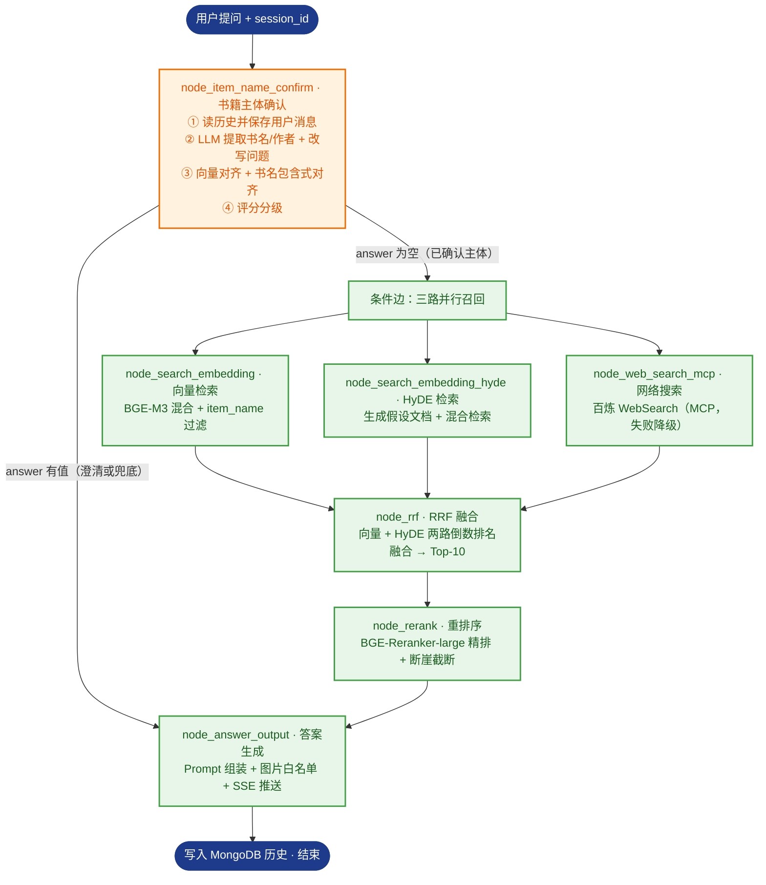

# ListenBook_Rag · 听书智库

> 面向听书平台的 RAG（Retrieval-Augmented Generation）智能知识库系统。围绕 **有声书信息 / 书籍简介 / 作者介绍 / 听书笔记 / 推荐运营资料 / 用户评论摘要 / 常见问答** 七类内容，提供 **书籍推荐、书籍详情、内容检索、知识问答** 四大能力，支持多轮对话与流式输出。工作流由 LangGraph 编排，以 BGE-M3 混合向量 + Milvus 承载检索，FastAPI 对外提供接口。

[](https://github.com/python/cpython)
[](https://github.com/fastapi/fastapi)
[](https://github.com/langchain-ai/langgraph)
[](https://github.com/milvus-io/milvus)
[](https://huggingface.co/collections/BAAI/bge)
[](https://www.mongodb.com/)
[](https://github.com/minio/minio)

## 目录

- [项目简介](#项目简介)
- [核心能力（业务场景）](#核心能力业务场景)
- [核心特性](#核心特性)
- [技术栈](#技术栈)
- [目录结构](#目录结构)
- [知识库内容模型](#知识库内容模型)
- [导入管线（Content Pipeline）](#导入管线content-pipeline)
- [检索与问答管线（Query Pipeline）](#检索与问答管线query-pipeline)
- [快速开始](#快速开始quick-start)
- [环境变量配置](#环境变量配置)
- [HTTP 接口](#http-接口)
- [测试](#测试)
- [已知限制与路线图](#已知限制与路线图)
- [附录：节点分步说明](#附录节点分步说明)

## 项目简介

听书场景下的知识高度分散：书籍简介、作者背景、演播信息、听书笔记、运营推荐语、用户评论、常见问答等资料分散在不同文档中，用户想"找一本适合通勤听的悬疑小说""《三体》有哪些精彩书评"时，只能靠人工翻找或关键词搜索，语义理解弱、结果不可解释、来源难追溯。

listenbook_rag 用 RAG 的思路解决这个问题——**先检索、再生成**：

- **Retrieval（检索）**：把用户问题转换为向量，在知识库中检索相似内容；
- **Augmented（增强）**：将检索到的书籍资料作为上下文，与问题一起构建 Prompt；
- **Generation（生成）**：由 LLM 基于增强后的 Prompt 生成答案，并回传来源（书名 / 作者 / 内容类型 / 文件名）。

系统分为两条主线：**内容导入管线**把多类型听书资料加工为可检索切片并写入 Milvus；**检索问答管线**通过多路召回 + 融合排序，输出准确、可解释、可追溯的答案。

**当前完成度：导入模块（7 节点）与检索模块（7 节点）全部实现，端到端链路已跑通**（PDF/MD → 切片 → Milvus → 多路召回 → RRF → 重排 → 答案生成 → SSE 流式问答），导入服务（8000）与检索服务（9091）可分别启动，配套的导入页与问答页均已可用。

## 核心能力（业务场景）

| 能力         | 说明                                                         | 典型提问                                             |
| ------------ | ------------------------------------------------------------ | ---------------------------------------------------- |
| **书籍推荐** | 按书名 / 作者 / 类别 / 场景标签查找，返回书籍列表、特色、适合人群与推荐理由 | "有哪些科幻类有声书？""推荐一个适合通勤听的悬疑小说" |
| **书籍详情** | 查询书籍简介、作者介绍、有声书时长、演播信息、内容标签、听书亮点与常见问题 | "《三体》的演播是谁？多长时间？"                     |
| **内容检索** | 定位书籍资料与听书笔记，返回书名、作者、内容类型、文件名等来源信息 | "《红楼梦》相关的听书笔记有哪些？"                   |
| **知识问答** | 基于知识库内容生成答案，附带引用来源，支持多轮对话与流式输出 | "这本书适合谁听？核心看点是什么？"                   |

> 交互上支持 **单轮问答 / 多轮对话 / SSE 流式输出 / 历史记录管理**。

## 核心特性

- **LangGraph 有状态编排**：`StateGraph` + 条件路由，PDF / Markdown 双入口自动分流，导入与查询两条链路复用同一套状态管理
- **多类型内容统一建模**：七类内容（有声书信息 / 书籍简介 / 作者介绍 / 听书笔记 / 推荐运营资料 / 用户评论摘要 / 常见问答）统一字段模型，导入即带上元数据
- **PDF 结构化解析**：接入 MinerU 在线 API（上传 → 轮询 → 下载解压 → 统一命名），保留表格 / 公式 / 图片
- **图片语义化**：Qwen3-VL-Flash 视觉模型生成图片描述，图片上传 MinIO，Markdown 引用替换为 ``
- **标题感知切分**：按 Markdown 标题层级初切 → `RecursiveCharacterTextSplitter` 递归二次切分（`CHUNK_SIZE=600` / 重叠 `90`）→ 注入 `title` / `parent_title` / `file_title` / `part` 元数据
- **书籍主体识别**：LLM 从文档前若干切片识别书籍主体（`item_name`，形如 `三体-刘慈欣`），并回填 `content_type` / `book_name` / `author` / `category` / `duration` / `source_file` / `source_path`
- **稠密 + 稀疏混合向量**：BGE-M3 生成 1024 维稠密向量（语义）与稀疏向量（词袋，精确关键词匹配）
- **多路召回 + 融合排序**：向量检索 / HyDE 假设文档检索 / MCP 网络搜索三路并行，RRF 融合后用本地 BGE-Reranker-large 精排，断崖检测动态截断
- **书籍主体对齐**：向量对齐 + **按"书名部分"包含式比对**（用户说"三体"也能对齐到库里的"三体-刘慈欣"），置信度分级（确认 / 候选澄清 / 兜底追问）
- **流式问答与记忆**：FastAPI + SSE 实时推送进度与答案，MongoDB 管理多轮历史对话（含 item_names 延迟回填）
- **答案图片白名单**：参考切片里真实存在的图片地址才允许出现在答案中，防止模型编造图片链接
- **工程化基础**：uv 锁定依赖、loguru 日志、任务进度追踪（节点中文名映射）、令牌桶限流、提示词模板化管理

## 技术栈

| 类别        | 选型                                                         |
| ----------- | ------------------------------------------------------------ |
| 语言 / 环境 | Python ≥ 3.11，uv 包管理（`uv.lock` 已提交）                 |
| 后端框架    | FastAPI + Uvicorn（异步、原生 SSE 流式响应）                 |
| 工作流      | LangGraph + LangChain（状态管理 + 条件路由 + 并发编排）      |
| LLM         | 通义千问 Qwen-Flash（阿里云百炼 DashScope，OpenAI 兼容模式） |
| 视觉模型    | 通义千问 Qwen3-VL-Flash（图片描述生成）                      |
| 向量模型    | BGE-M3（1024 维稠密 + 稀疏混合向量）                         |
| 重排序模型  | BGE-Reranker-large（本地 Cross-Encoder 精排 + 断崖检测截断）  |
| 向量数据库  | Milvus（混合检索，WeightedRanker 加权融合）                  |
| 文档数据库  | MongoDB（历史对话记录管理）                                  |
| 对象存储    | MinIO（原始文档 + 图片）                                     |
| 文档解析    | MinerU 在线 API（PDF → Markdown，保留表格 / 公式 / 图片）     |
| 网络搜索    | 百炼 WebSearch（MCP 协议调用，需 `mcp<2`；失败自动降级）      |
| 前端        | 原生 HTML + JavaScript + EventSource（SSE 流式接收）         |
| 日志        | loguru                                                       |

## 目录结构

```text
listenbook_rag/                    # 项目主体（在此目录执行 uv 命令）
├── pyproject.toml                 # 依赖与项目元信息
├── uv.lock                        # 锁定版本（提交，可复现环境）
├── .env / .env.example            # 环境变量（.env 含密钥不提交，模板可提交）
├── app/
│   ├── import_process/            # ★ 内容导入模块
│   │   ├── agent/
│   │   │   ├── state.py           # 导入状态定义（ImportGraphState）
│   │   │   ├── main_graph.py      # 导入图编排（条件路由 + 7 节点）
│   │   │   └── nodes/             # 7 个导入节点
│   │   ├── api/                   # file_import_service.py（导入服务，8000）
│   │   └── page/                  # import.html 导入页
│   ├── query_process/             # ★ 检索问答模块
│   │   ├── agent/
│   │   │   ├── state.py           # 查询状态定义（QueryGraphState）
│   │   │   ├── main_graph.py      # 查询图编排（条件路由 + 三路并行 + 7 节点）
│   │   │   └── nodes/             # 7 个检索节点
│   │   ├── api/                   # query_service.py（检索服务，9091）
│   │   └── page/                  # query.html 问答页
│   ├── clients/                   # Milvus / MinIO / Mongo 客户端封装
│   ├── conf/                      # 各服务配置类（读取 .env）
│   ├── core/                      # logger、load_prompt
│   ├── lm/                        # LLM / BGE-M3 / reranker 封装
│   ├── tool/                      # 模型下载脚本
│   └── utils/                     # 路径、限流、SSE 队列、任务进度等工具
├── prompts/                       # .prompt 提示词模板
├── test/                          # 后端流程测试（01~05 + samples）
├── doc/                           # 输入文档池（Git 忽略，clone 后自建）
├── output/                        # 处理产物（Git 忽略，clone 后自建）
└── logs/                          # 运行日志（Git 忽略）
```

## 知识库内容模型

每个切片（`listenbook_chunks` 集合）统一为如下字段，保证检索结果可解释、可追溯：

| 字段           | 类型 / 说明                                                  |
| -------------- | ------------------------------------------------------------ |
| `chunk_id`     | INT64 主键（自增）                                            |
| `content`      | 内容正文                                                      |
| `title`        | 切片标题（切分时生成，多片时带序号后缀）                      |
| `parent_title` | 所属一级标题                                                  |
| `part`         | 切片在所属标题内的序号（INT16）                               |
| `file_title`   | 文件标题（文件名去后缀），主体识别兜底用                      |
| `content_type` | 内容类型（见下表）                                            |
| `book_name`    | 书名（由 `item_name` 拆分得到）                               |
| `author`       | 作者名（由 `item_name` 拆分得到）                             |
| `item_name`    | 条目主体（形如 `三体-刘慈欣`），检索时的过滤键与幂等清理依据   |
| `category`     | 类别 / 标签（当前留空，待后续用大模型或后台配置补齐）          |
| `duration`     | 有声书时长（仅有声书类内容，从正文提取）                       |
| `source_file`  | 来源文件名                                                    |
| `source_path`  | 来源路径（处理后的 Markdown 路径）                             |
| `dense_vector` | FLOAT_VECTOR，1024 维（BGE-M3）                              |
| `sparse_vector`| SPARSE_FLOAT_VECTOR（BGE-M3）                                |

> 另有一个 `listenbook_item_names` 集合（主体库），字段为 `pk` / `file_title` / `item_name` / `dense_vector` / `sparse_vector`，用于检索时的书籍主体对齐。
>
> 索引：稠密 `HNSW-COSINE`；稀疏 `SPARSE_INVERTED_INDEX-IP`。

**内容类型枚举**

| 枚举值            | 说明         |
| ----------------- | ------------ |
| `audiobook_info`  | 有声书信息   |
| `book_intro`      | 书籍简介     |
| `author_intro`    | 作者介绍     |
| `listening_note`  | 听书笔记     |
| `recommendation`  | 推荐运营资料 |
| `comment_summary` | 用户评论摘要 |
| `faq`             | 常见问答     |

> 当前 `content_type` 由**文件名关键词**推断（见 `node_item_name_recognition.py` 顶部 `CONTENT_TYPE_KEYWORDS`），零成本且结果稳定；若需要更准，可改为让大模型直接输出结构化 JSON。

## 导入管线（Content Pipeline）


| #    | 节点                       | 职责            | 关键产物 / 动作                                              |
| ---- | -------------------------- | --------------- | ------------------------------------------------------------ |
| 1    | node_entry                 | 文件入口        | 判断 `.pdf` / `.md`，设置路由标记，提取 `file_title`         |
| 2    | node_pdf_to_md             | PDF 转 Markdown | MinerU 上传解析、轮询、解压取 md                             |
| 3    | node_md_img                | 图片处理        | Qwen3-VL 摘要 + 上传 MinIO + 替换 Markdown 链接              |
| 4    | node_document_split        | 文档切分        | 标题初切 + 递归二次切分 + 元数据注入 → `chunks`（备份 JSON） |
| 5    | node_item_name_recognition | 书籍主体识别    | LLM 识别书名/作者，回填书籍域元数据，写入 `listenbook_item_names` |
| 6    | node_bge_embedding         | 向量生成        | BGE-M3 批量生成稠密 + 稀疏向量                               |
| 7    | node_import_milvus         | 导入向量库      | 建 `listenbook_chunks`、按 `item_name` 幂等删旧、插入并回填 `chunk_id` |

## 检索与问答管线（Query Pipeline）



| #    | 节点                       | 职责         | 关键动作                                                     |
| ---- | -------------------------- | ------------ | ------------------------------------------------------------ |
| 1    | node_item_name_confirm     | 书籍主体确认 | 历史记录 → LLM 提取书名/作者 + 改写 → 向量对齐 → 评分分级（确认 / 候选 / 追问） |
| 2    | node_search_embedding      | 向量检索     | BGE-M3 混合向量检索 + 按 `item_name` 过滤                    |
| 3    | node_search_embedding_hyde | HyDE 检索    | 生成假设文档 → 组合向量检索，提升模糊问题召回                |
| 4    | node_web_search_mcp        | 网络搜索     | MCP 协议调用百炼 WebSearch，补充时效信息（失败自动降级）      |
| 5    | node_rrf                   | RRF 融合     | 倒数排名融合（k=60），去重排序截断 Top-10                     |
| 6    | node_rerank                | 重排序       | BGE-Reranker-large 精排 + 断崖检测动态截断（上限 10 / 下限 1） |
| 7    | node_answer_output         | 答案生成     | Prompt 组装（含书名/作者/类型/文件名）→ LLM 生成 → 图片白名单 → SSE 输出 |

## 快速开始（Quick Start）

> 环境要求：Python ≥ 3.11、uv、可访问的 Milvus / MongoDB / MinIO 服务。

### 1. 安装 uv（已安装可跳过）

```powershell
# Windows（PowerShell）
powershell -ExecutionPolicy ByPass -c "irm https://astral.sh/uv/install.ps1 | iex"
```

```bash
# macOS / Linux
curl -LsSf https://astral.sh/uv/install.sh | sh
```

### 2. 还原依赖环境

```bash
cd listenbook_rag
uv sync --frozen
```

### 3. 配置环境变量

```bash
# Windows
Copy-Item .env.example .env
# macOS / Linux
cp .env.example .env
```

打开 `.env` 按注释填写，至少确认：

- 百炼 LLM：`OPENAI_API_KEY`、`OPENAI_BASE_URL`、`LLM_DEFAULT_MODEL`、`VL_MODEL`
- MinerU：`MINERU_API_TOKEN`（PDF 入口必需）
- Milvus：`MILVUS_URL`（默认 `http://localhost:19530`）
- MinIO：`MINIO_ENDPOINT` 填 `IP:9000`（不带 `http://`，且不是 9001 控制台端口）
- MongoDB：`MONGO_URL`、`MONGO_DB_NAME`
- BGE-M3：`BGE_M3_PATH` 指向本地模型；留空则首次运行自动下载
- 重排：`BGE_RERANKER_LARGE` 指向本地 BGE-Reranker-large 模型

### 4. 准备输入文档

`doc/`、`output/` 已被 Git 忽略，clone 后需手动创建：

```powershell
New-Item -ItemType Directory doc, output
```

将听书资料（书籍简介 / 作者介绍 / 听书笔记 / 推荐语 / 评论摘要 / FAQ 等）放入 `doc/`。

### 5. 启动服务

两个服务互相独立，可分别启动（**注意：两个服务必须用不同端口，且不要与其它项目（如 RAG 模板）抢占 8000 / 9091**）：

```bash
# 均在 listenbook_rag 目录下执行。必须用 -m 方式，才会把项目根加入 sys.path 以 import app.*

# ① 导入服务：文件上传页面 + 导入流水线
uv run python -m app.import_process.api.file_import_service
# 页面：http://127.0.0.1:8000/import.html

# ② 检索服务：问答页面 + 检索流水线（SSE 流式）
uv run python -m app.query_process.api.query_service
# 页面：http://127.0.0.1:9091/query.html
```

| 服务     | 端口 | 页面                                  | 职责                           |
| -------- | ---- | ------------------------------------- | ------------------------------ |
| 导入服务 | 8000 | `http://127.0.0.1:8000/import.html`   | 上传 PDF / MD，执行导入流水线   |
| 检索服务 | 9091 | `http://127.0.0.1:9091/query.html`    | 提问，执行检索流水线并流式返回   |

> 建议通过服务自身打开页面（同源最稳）。页面内的 `API_HOST` 只会把 **9091 同源** 视为后端；
> 其余情况（IDE 内置预览、静态服务器、`file://`）一律回退到 `query.html` 顶部的 `API_HOST`
> （默认 `http://127.0.0.1:9091`）。改端口时请同步修改 `query_service.py` 与页面里的 `API_HOST`。

### 6. 代码方式调用导入管线

```python
from app.import_process.agent.main_graph import kb_import_app
from app.import_process.agent.state import create_default_state

state = create_default_state(
    task_id="demo_001",
    local_file_path="doc/三体简介.md",   # 相对 listenbook_rag 目录
    local_dir="output",
)
result = kb_import_app.invoke(state)

print("识别主体：", result["item_name"])
print("切片数量：", len(result["chunks"]))
```

### 7. 代码方式调用检索管线

```python
from app.query_process.agent.main_graph import kb_query_app
from app.query_process.agent.state import create_query_default_state

state = create_query_default_state(
    session_id="demo_001",
    original_query="《三体》适合谁听？",
)
result = kb_query_app.invoke(state)

print("确认书籍主体：", result["item_names"])
print("重写后问题：", result["rewritten_query"])
print("最终答案：", result["answer"])
```

## 环境变量配置

各配置项均以 `.env.example` 为准，此处为概要：

| 配置区块    | 是否必需        | 关键变量                                                     | 说明                   |
| ----------- | --------------- | ------------------------------------------------------------ | ---------------------- |
| LLM（百炼） | 必需            | `OPENAI_API_KEY` `OPENAI_BASE_URL` `LLM_DEFAULT_MODEL` `VL_MODEL` | 文本 / 视觉模型        |
| MinerU      | PDF 入口必需    | `MINERU_API_TOKEN` `MINERU_BASE_URL`                         | PDF 转 Markdown        |
| Milvus      | 必需            | `MILVUS_URL` `CHUNKS_COLLECTION` `ITEM_NAME_COLLECTION` `EMBEDDING_DIM` | 向量库与集合名（当前为 `listenbook_chunks` / `listenbook_item_names`） |
| MongoDB     | 必需            | `MONGO_URL` `MONGO_DB_NAME`（集合固定为 `chat_message`）      | 历史对话记录           |
| BGE-M3      | 必需            | `BGE_M3_PATH` `BGE_DEVICE` `BGE_FP16`                        | 本地模型路径或在线兜底 |
| Reranker    | 检索模块必需    | `BGE_RERANKER_LARGE` `BGE_RERANKER_DEVICE` `BGE_RERANKER_FP16` | 本地 Cross-Encoder 精排模型 |
| MinIO       | md 含图片时必需 | `MINIO_ENDPOINT` `MINIO_ACCESS_KEY` `MINIO_SECRET_KEY` `MINIO_BUCKET_NAME` `MINIO_IMG_DIR` `MINIO_SECURE` | 图片对象存储 |
| 网络搜索    | 可选            | `MCP_DASHSCOPE_BASE_URL`                                     | 百炼 WebSearch（MCP），鉴权复用 `OPENAI_API_KEY`；**依赖 `mcp<2`**（见[已知限制](#已知限制与路线图)） |
| 日志        | 可选            | `LOG_CONSOLE_*` `LOG_FILE_*`                                 | 控制台 / 文件日志      |

## HTTP 接口

两个服务各自提供接口，常用的如下：

**导入服务（8000）**

| 方法   | 路径                | 说明                                                         |
| ------ | ------------------- | ------------------------------------------------------------ |
| `POST` | `/upload`           | 上传内容文件，写入 `output/<日期>/<task_id>/`，启动后台导入任务，返回 `task_ids` |
| `GET`  | `/status/{task_id}` | 查询导入进度：`status` / `done_list` / `running_list`（中文节点名） |
| `GET`  | `/import.html`      | 内容导入页面                                                 |

**检索服务（9091）**

| 方法     | 路径                    | 说明                                                         |
| -------- | ----------------------- | ------------------------------------------------------------ |
| `POST`   | `/query`                | 发起问答；`is_stream=true` 返回 `session_id`（走后台任务 + SSE），否则同步返回完整答案 |
| `GET`    | `/stream/{session_id}`  | 建立 SSE 长连接，接收 `ready` / `progress` / `delta` / `final` / `error` 事件；链路结束后由服务端主动关闭 |
| `GET`    | `/history/{session_id}` | 查询该会话的历史对话记录                                     |
| `DELETE` | `/history/{session_id}` | 清空该会话历史                                               |
| `GET`    | `/health`               | 健康检查                                                     |
| `GET`    | `/query.html`           | 智能问答页面                                                 |

## 测试

`test/` 下是**后端流程测试脚本**，按依赖顺序编号，可单独运行。
所有脚本都自带 `sys.path` 引导，**直接运行即可，无需手动设置 `PYTHONPATH`**。

| 脚本                     | 验证内容                        | 前置条件                    |
| ------------------------ | ------------------------------- | --------------------------- |
| `test/01_llm_test.py`    | 文本模型 + 视觉模型连通性        | `.env` 已配置               |
| `test/02_bgem3_test.py`  | BGE-M3 稠密(1024) / 稀疏向量生成 | 本地模型路径或联网          |
| `test/03_milvus_test.py` | Milvus 连接、集合字段完整性、数据量 | Milvus 服务              |
| `test/04_import_test.py` | 导入全链路：PDF/MD → chunks → Milvus | LLM + Milvus + `doc/` 测试文件 |
| `test/05_query_test.py`  | 检索问答全链路：提问 → 检索 → 答案 | 已导入数据 + Mongo + 重排模型 |

```bash
cd listenbook_rag
uv run python test/01_llm_test.py          # 先体检
uv run python test/03_milvus_test.py       # 看集合与数据量
uv run python test/04_import_test.py       # 导入（会自动取 doc/ 下第一个文件）
uv run python test/05_query_test.py        # 问答
```

补充说明：

- `04_import_test.py` 支持 `--dry-run`（只检查文件与路由，不调模型、不写库）；它会把源文件复制到
  `output/test_import/<文件名>/` 再导入（模拟前端上传流程），因此 `doc/` 不会被 `*_new.md` / `backup.json` 污染。
- `05_query_test.py` 支持 `--dry-run`、`--session`，也可直接传问题：`uv run python test/05_query_test.py "《三体》适合谁听？"`。
- `test/samples/` 下有一份示例资料，`doc/` 为空时自动兜底，便于开箱即跑。
- 每个节点文件（`app/**/nodes/*.py`）也自带 `if __name__ == "__main__"` 自测入口，可单独运行验证。

> **注意（数据安全）**：`node_import_milvus.py`、`node_item_name_recognition.py` 等节点的 `__main__` 自测块会**直接写入真实 Milvus 集合**。运行后请检查并按需清理；正式数据建议另起集合或加环境开关。

## 已知限制与路线图

**已知限制**

- **网络搜索依赖 `mcp<2`**：`mcp` 2.x 的客户端会先发 `server/discover`（protocolVersion `2026-07-28`），而百炼 `BaiLianMcpServer` 只认 `2024-11-05`，会直接返回 HTTP 500（表现为 `node_web_search_mcp` 报 `Failed to connect to MCP server`）。已在 `pyproject.toml` 锁定 **`mcp<2`**（实测 1.30.0 正常）；若某天升级依赖后网络搜索突然失效，先检查这里。该路失败时仍会自动降级为"仅本地召回"。
- **Windows 断连噪音**：SSE 长连接被浏览器主动断开（刷新页面 / 关标签页）时，Proactor transport 会抛 `WinError 10054`，被 asyncio 默认处理器打成 `ERROR:asyncio` 堆栈。已在两个服务的 lifespan 中安装 `app/utils/asyncio_utils.py` 的过滤器降级为 DEBUG，并把 `sse_utils` 里断连后的刷屏输出也降为 DEBUG。
- **端口与 RAG 模板冲突**：模板项目与本项目都用 8000（导入）/ 9091（检索），两者不能同时启动。
- **主体名对齐**：切片库存的是"书名-作者"复合主体（如 `三体-刘慈欣`）；已用"按书名部分包含式对齐"兜底，但若同名书籍有多位作者/多版本，会全部命中（属预期，利于跨文件召回）。
- **`category` 尚未填充**：类别/标签字段已建好但暂无来源，需要大模型或后台配置补齐。
- `duration` 仅在 `content_type=audiobook_info` 时从正文正则提取，取不到则为空。
- 导入与检索采用本地方案，模型缓存依赖本地路径或首次联网下载。
- `clients/mongo_history_utils_new.py` 与 `mongo_history_utils.py` 内容重复，当前只用后者，属历史遗留。
- 任务状态与 SSE 队列在进程内存中（单进程、重启即丢）；长任务走 FastAPI BackgroundTasks，无重试。
- 接口无鉴权、CORS 为 `*`、MinIO 桶为公开读，仅适合内网 demo。
- `doc/`、`output/`、`logs/` 为本地数据，clone 后需要手动创建。

**路线图**

- [x] 内容导入管线（七节点：PDF/MD → chunks → Milvus）
- [x] 检索问答管线（书籍主体确认 → 多路召回 → RRF → rerank → 答案生成）
- [x] FastAPI 服务 + SSE 流式推送
- [x] 前端页面（导入页 + 智能问答页）
- [x] 历史对话管理（MongoDB，含 item_names 延迟回填）
- [ ] 答案引用溯源：在答案中显式标注书名 / 作者 / 内容类型 / 文件名
- [ ] 增量更新：文档增量入库与版本管理
- [ ] 权限控制与多租户支持
- [ ] 个性化推荐、听书路径等听书能力
- [ ] 语音检索：语音转文本 / 字幕 / 时间轴文本定位片段（返回书名、作者、起止时间、片段摘要）
- [ ] 多模态检索：封面图片与内容联合检索

## 附录：节点分步说明

### 导入模块

#### 1. node_entry — 入口节点

1. 接收状态，获取 `local_file_path`（为空则告警并返回）；
2. 判断文件类型：`.pdf` / `.md` / 其他不支持格式；
3. 设置路由标记并记录路径：`is_pdf_read_enabled` / `is_md_read_enabled`，对应写入 `pdf_path` / `md_path`；
4. 提取 `file_title`（文件名去后缀），作为后续识别的兜底。

#### 2. node_pdf_to_md — PDF 转 Markdown

1. **路径校验** — `pdf_path`、`local_dir`（为空回退到 `output/`，不存在则创建）；
2. **MinerU 解析** — 请求上传链接（请求体带 `model_version: "vlm"`）→ 上传 PDF → 轮询解析结果（间隔 3s、最长 600s）；
3. **下载解压** — 优先级：同名 md → `full.md` → 第一个，统一改名为 `{stem}.md`，更新 `md_path` / `md_content`。

#### 3. node_md_img — 图片处理

1. 校验 `md_path` / `md_content`，定位 md 同目录的 `images/`（不存在则跳过，纯文本资料不会报错）；
2. 扫描图片文件并定位其在 md 中的引用，截取前后各 100 字符作为上下文；
3. 调用 Qwen3-VL-Flash 生成图片摘要（带上下文、限流保护）；
4. 先按 `{MINIO_IMG_DIR}/{stem}` 前缀删除旧图，再上传并替换为 ``；
5. 另存 `原名_new.md`，更新 state。

#### 4. node_document_split — 文档切分

1. **清洗内容** — 取 `md_content` / `file_title`，统一换行符；
2. **标题初切** — 按 Markdown 标题（1–6 级）切分，跳过代码块；无标题则整篇作为「无主题」；
3. **递归二次切分** — `RecursiveCharacterTextSplitter`（`CHUNK_SIZE=600` / 重叠 `90`）；切出多片时标题追加序号后缀；
4. **元数据注入与备份** — 注入 `title` / `parent_title` / `file_title` / `part`，写入 `chunks` 并备份为 `backup.json`。

#### 5. node_item_name_recognition — 书籍主体识别

1. **取值** — 获取 `file_title`、`chunks`（为空抛异常）；
2. **构建上下文** — 从第 1 条切片起拼「切片：n，标题：x，内容：y」，累计字符达 2500 即停止；
3. **LLM 识别** — 用 `book_recognition_system`（系统）+ `item_name_recognition`（用户）提示词识别主体，失败兜底为文件名；
4. **元数据回填** — 为每个切片写入 `item_name` / `content_type` / `book_name` / `author` / `category` / `duration` / `source_file` / `source_path`；
5. **写入主体库** — 生成主体向量，按 `item_name` 幂等写入 `listenbook_item_names`。

#### 6. node_bge_embedding — 向量生成

1. 校验 `chunks` 非空；
2. 每批 5 条，参与向量化的文本为「书名：{item_name}，内容：{content}」，BGE-M3 生成稠密 + 稀疏向量并回填 `dense_vector` / `sparse_vector`；某批失败则该批原样保留，不阻断流程。

#### 7. node_import_milvus — 导入向量库

1. 校验 `chunks` 非空；
2. 不存在则创建 `listenbook_chunks`（16 个字段，见[知识库内容模型](#知识库内容模型)；稠密 HNSW-COSINE、稀疏 SPARSE_INVERTED_INDEX-IP）；
3. 按 `item_name` 幂等删除旧数据并重新加载集合；
4. 批量写入 Milvus，把返回的 `chunk_id` 回填到各切片。

### 检索问答模块

#### 1. node_item_name_confirm — 书籍主体确认

1. 按 `session_id` 从 MongoDB 读取近期对话，写入 `state["history"]`；同时把当轮用户消息写入历史并拿到 `message_id`；
2. 加载 `rewritten_query_and_itemnames` 提示词，结合历史做指代消解，LLM 返回 `item_names` 与 `rewritten_query`；
3. **向量对齐** — 将 `item_names` 向量化，在 `listenbook_item_names` 做混合检索（0.8:0.2，Top-5）；
4. **书名包含式对齐（听书域补充）** — 按分隔符取"书名部分"比对，用户说「三体」也能对齐到库内的「三体-刘慈欣」，并纳入同名书籍的全部主体；
5. **评分分级** — `≥0.85` 直接确认；`0.6~0.85` 取前 3 条作为候选并生成澄清话术；`<0.6` 走兜底追问；
6. 回填历史中 `item_names` 为空的记录，并写回最终历史。

#### 2. node_search_embedding — 向量检索

1. 校验 `item_names`（为空返回空结果）；
2. 用 BGE-M3 将 `rewritten_query` 转成稠密 + 稀疏向量；
3. 拼 `item_name in ['...']` 过滤表达式；
4. 混合检索 `listenbook_chunks`（0.8:0.2 加权 + 归一化），返回 Top-5（含书名 / 作者 / 内容类型 / 来源文件等字段）。

#### 3. node_search_embedding_hyde — HyDE 检索

1. 用 `hyde_prompt` 让 LLM 生成一段 ≤300 字的"理想答案范文"；
2. 把"改写问题 + 假设文档"拼接后向量化，叠加主体过滤，在 `listenbook_chunks` 做混合检索（req_limit=10、limit=5）；
3. `rewritten_query` 为空时退回 `original_query`；生成或检索异常返回空结果。

#### 4. node_web_search_mcp — 网络搜索

1. 校验 `rewritten_query`（为空则跳过）；
2. 通过 `MCPServerStreamableHttp` 连接百炼 MCP，调用 `bailian_web_search`（count=5，最多重试 2 次）；
3. 把返回 JSON 的 `pages` 整理为 `{title, url, snippet}`；
4. **降级保护**：MCP 不可用/超时/异常时记告警并返回空列表，不影响本地两路召回。
   > 注意：该节点依赖 `mcp<2`；`mcp` 2.x 会因 `server/discover` 握手不被百炼支持而报 HTTP 500。

#### 5. node_rrf — RRF 融合

1. 把 Milvus 的 Hit 对象 / 字典统一成实体字典，并补齐 `chunk_id` 与 `score`；
2. **仅融合「向量检索」与「HyDE 检索」两路**，按 `score(d) = Σ weight_i / (k + rank_i(d))` 累加（两路权重 1.0、`k=60`），同一 `chunk_id` 多路命中则分数累加；
3. 降序截断保留 Top-10，写入 `rrf_chunks`。

#### 6. node_rerank — 重排序

1. **多源合并** — 本地切片（携带书名 / 作者 / 内容类型 / 来源文件）与网络搜索结果统一成同一结构（`text` / `title` / `url` / `source` + 书籍元数据）；
2. **精排打分** — 本地 BGE-Reranker-large（Cross-Encoder）对「问题 + 文档」逐对打分并降序；模型不可用时降级为全 0 分，不阻断流程；
3. **动态 TopK 截断** — 从 `RERANK_MIN_TOPK`(1) 起逐对比相邻分数，绝对差 ≥ `RERANK_GAP_ABS`(2) 或相对差 ≥ `RERANK_GAP_RATIO`(0.5) 判定断崖并截断；上限 `RERANK_MAX_TOPK`(10)。

#### 7. node_answer_output — 答案生成

1. **检查已有答案** — 若 `state["answer"]` 已有值（主体需澄清或未找到书籍的兜底话术），直接透传输出；
2. **构建 Prompt** — 参考切片按 `[序号] [来源] [书名=..] [作者=..] [内容类型=..] [来源文件=..] [chunk_id=..] [score=..] [title=..]` + 正文组织；上下文累计超 `MAX_CONTEXT_CHARS`（12000）即截断；
3. **LLM 生成** — 流式调用大模型，逐 token 通过 SSE `delta` 事件推送；
4. **图片提取与白名单校验** — 先从参考切片提取真实图片 URL 作为白名单，再清洗答案（Markdown 图片整段删除、正文游离图片 URL 删除、`【图片】` 区块只保留白名单内地址，全部不合法则连区块标题一起删除）；
5. **保存历史** — 以 `assistant` 角色写入 MongoDB（含 `item_names` 与 `image_urls`）；
6. **SSE 结束事件** — 先 `add_done_task` 把本节点移入"已完成"，再推送 `final`，携带清洗后的答案、`image_urls`，以及**进度快照** `status` / `done_list` / `running_list`（供前端直接渲染收尾状态）。

> **前端约定**：流式 `delta` 阶段只渲染文字，图片统一在 `final` 事件渲染，避免编造地址"闪一下又消失"。
>
> **收尾时序（易踩坑）**：前端收到 `final` 后会**立即关闭 SSE 连接**，此后后端再推的 `progress` 一律收不到。因此凡是"把节点标记为已完成"的进度推送（`add_done_task`、`update_task_status(COMPLETED)`）都必须排在 `final` **之前**，否则进度条会残留"⏳ 生成答案 / 状态：处理中"。前端另有一层兜底：缓存最后一次进度快照，在 `final` / `error` 时补齐收尾状态。
>
> **连接收尾**：后台任务结束后，服务端推送 `__close__`（`SSEEvent.CLOSE`）主动关闭 SSE 流；否则非浏览器客户端（如 `curl -N`）会一直挂着直到超时。
